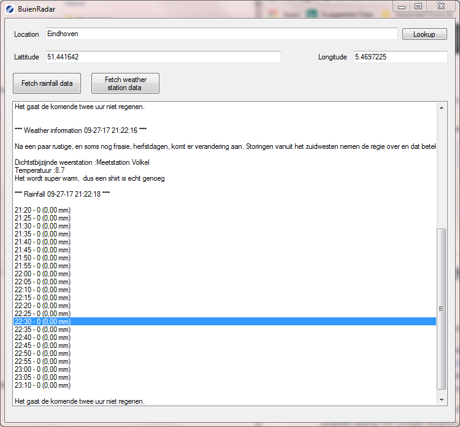

BuienRadar API - Retreiving rain prediction and weather information for the Netherlands
====================

*A .NET API for fetching rain predictions and weather information from BuienRadar, including demonstration application.*

BuienRadar API is an API that fetches raw rain precipitation through the free Buienradar API at "http://gadgets.buienradar.nl/data/raintext?lat=LATTITUDE&lon=LONGITUDE" and weatherstation information at "https://xml.buienradar.nl/". The data is cached for a settable duration in order to not overburden the buienradar servers. It also provides a rain info-to-text translation finding perionds of rain and describing these.

To demonstrate the usage of the API, a minimal application has been included that fetches the data, based on any given location (using the Google location service)

Please note that when using buienradar data, ask permission here: https://www.buienradar.nl/overbuienradar/contact and please provide link to buienradar.nl in your application. Also note that the while the code provided here is open source, the data MIT 

## Features

* Fetching of precipitation data and weatherstation information
* Data caching 
* Synchronous and asynchronous fetching
* Smart(ish) data-to-text parsing
* Demonstation Application
* MIT License

## Tested  

* C# .NET
* MONO, .NET core are to be tested. 

## Downloading

This Application is not available through Nuget can only be downloaded from GitHub. 

- By directly loading fetching the Archive from GitHub: 
  1. Go to [https://github.com/thijse/Buienradar](https://github.com/thijse/Buienradar)
  2. Click the DOWNLOAD ZIP button in the panel on the
  3. Optionally rename the uncompressed folder **Buienradar-master** to **Buienradar**.

- By downloading a release
  1. Go to releases
  2. Click the 'Source code' button

## Copyright

The buienradar site says this about usage of their data:

"Buienradar provides free weather data available to individuals and businesses (website / intranet). The use of the weather data below is only allowed for non-commercial purposes, and referencing the source is mandatory. The use for mobile applications or commercial purposes requires permission from Buienradar, see  the disclaimer"

Request permission for using the weather data here: [https://www.buienradar.nl/overbuienradar/contact]

[source: https://www.buienradar.nl/overbuienradar/gratis-weerdata]

The BuienRadar API on this site is provided under MIT License, Copyright © 2017.

